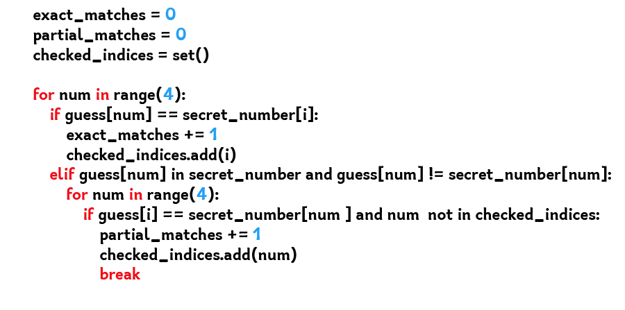

<h1> Hi! 👋 I am Yovko Buchkov </h1>

I am a Junior Python Developer and CCNA Network Engineer. 

### 🚀 About Me:
- 🔭 I'm a student at SoftUni and participating in the 100 Days of Code challenge on Udemy!
- 🌱 I'm currently learning Python and improving my coding skills.
- 👯 I'm looking to collaborate with other content creators and developers.
- 🥅 2024 Goals: Contribute more to Open Source projects and enhance my skills.

<h1>  Languages and Tools I use </h1>
  

  

 

### 📈 GitHub Stats:

### 📕 Latest Blog Posts
<!-- BLOG-POST-LIST:START -->
<!-- BLOG-POST-LIST:END -->

### 🏆 Achievements:
 [in progress]Successfully completed the Python Fundamentals course at SoftUni. 
 [in progress] Participated in the 100 Days of Code challenge and improved my coding skills. 
 [in progress] Contributed to several open-source projects. 

### 🔗 Useful Links:
 [My Portfolio](https://github.com/YovkoBuchkov)
 [My Resume](https://www.linkedin.com/in/yovko-buchkov-87098aba)

### 🎉 Thank You for Visiting My Profile!

Feel free to reach out and connect with me on LinkedIn or check out my projects on GitHub. Let's collaborate and build something amazing together!

